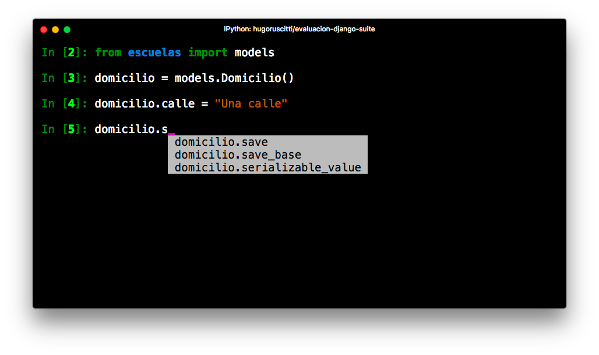
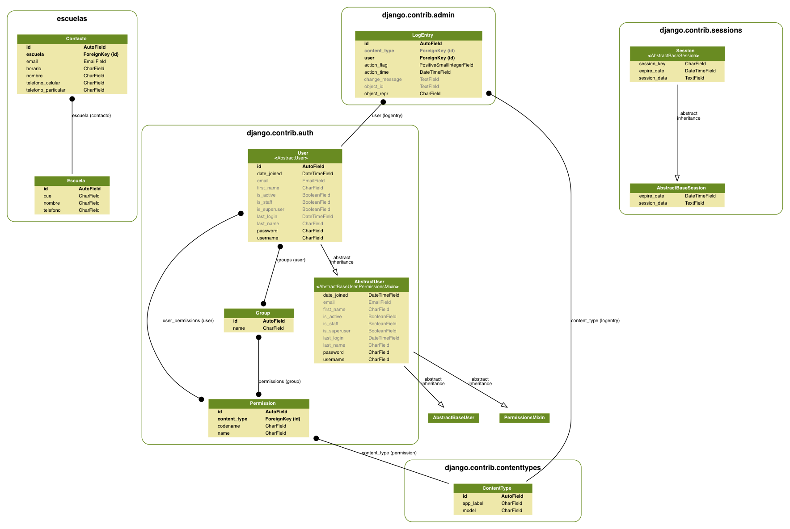

# SUITE 2

[](https://travis-ci.org/hugoruscitti/evaluacion-django-suite)

## ¿Cómo iniciar la aplicación?

El primer paso es crear un entorno virtual y activarlo:

```
virtualenv venv --no-site-packages
. venv/bin/activate
```

instalar las dependencias especificadas en el archivo
requirements.txt:

```
make iniciar
```

Luego, hay que preparar la base de datos de desarrollo:

```
make migrar
```

También es buena idea crear un usuario para poder
acceder al administrador de django:

```
make admin
```

## Cómo iniciar el servidor

Para iniciar el servidor en modo desarrollo hay que
ejecutar el siguiente comando:

```
make serve
```

y luego abrir la dirección:

- http://127.0.0.1:8000/

o bien, la siguiente dirección para abrir la interfaz de administración:

- http://127.0.0.1:8000/admin


## Cómo crear un nuevo modelo de base de datos

Para crear un nuevo modelo en la base de datos hay que crear un nuevo
archivo dentro del directorio `suite/escuelas/models` y luego vincularlo desde
el archivo `suite/escuelas/models/__init__.py`.

Por ejemplo, vamos a suponer que queremos crear una tabla nueva que nos
permita guardar la dirección de un contacto asociado a una
escuela.

(Ojo, esto es un ejemplo ilustrativo, no contempla direcciones en
departamentos ni nada parecido, es solo un ejemplo rápido )

El modelo de datos actual es así:


Y lo que nos gustaría hacer es crear una tabla de domicilios que se vincule
con un contacto así:


Tendríamos que escribir un archivo nuevo llamado `suite/escuelas/models/domicilio.py`
con este contenido :

```
from django.db import models

class Domicilio(models.Model):
    calle = models.CharField(max_length=500)
    numeracion = models.IntegerField()

    class Meta:
        db_table = 'domicilios'
```

Y luego agregar esta linea al archivo `suite/escuelas/models/__init__.py`:

```
from domicilio import Domicilio
```

Y para que se relacione con un contacto tendríamos
que declarar la relación en la clase Contacto
(archivo `suite/escuelas/models/contacto.y`):

```
class Contacto(models.Model):
    # [Los otros campos irían acá]

    domicilio = models.ForeignKey('Domicilio', null=True)
```

Ahora, como cambiamos el modelo, necesitamos escribir una migración
para que django pueda modificar la estructura de la base de datos y migrar
todos los registros existentes.

Para crear una migración hay que escribir el comando:

```
make crear_migraciones
```

Lo que va a salir en pantalla es un reporte de los cambios que detectó
django y la ruta a un archivo conteniendo la migración:

```
Migrations for 'escuelas':
  suite/escuelas/migrations/0002_auto_20161203_2350.py:
    - Create model Domicilio
    - Add field domicilio to contacto
```

Lo interesante de este archivo, es que nos va a servir para hacer un seguimiento
de los cambios en la base de datos. Ese archivo se tiene que subir
al respositorio y le va a servir al equipo entero para replicar la mísma base
de datos en otra pc.

Por último, para que estos cambios impacten realmente en la base de datos
tenemos que ejecutar nuevamente:

```
make migrar
```

Por último, un paso opcional: si queremos investigar el SQL que django
generará para modificar la base de datos podemos usar el número de la
migración y lanzar un comando de consulta:

```
python suite/manage.py sqlmigrate escuelas 0002
```

Este comando va a imprimir (pero sin ejecutar) el código SQL que sugiere
la migración. Es importante notar que no es solo un "CREATE TABLE" y
"ALTER TABLE", Django se encarga de generar una tabla temporal con la
estructura vieja, crear una tabla nueva, mover los registros para no perder
ningún dato y dejar todo funcionando nuevamente.


### Cómo realizar las operaciones básicas del ORM

Para acceder al ORM y ejecutar algunas pruebas podemos usar el comando:

```
make shell
```

Esto abrirá un intérprete de python, con autocompletado y algunas utilidades
muy prácticas. Por ejemplo:



Con `tab` podemos autocompletar, y usando el signo `?` o `??` a la derecha
de algún objeto podemos obtener ayuda sobre cómo utilizarlo:


Este intérprete de prueba también sirve para otras cosas, como para sacarnos
dudas a la hora de escribir un tests o investigar la API de django.

#### Cómo crear registros

Simplemente hay que crear un objeto desde la clase del modelo, cargar
valores y llamar a 'save':

```
>>> from escuelas import models
>>> domicilio = models.Domicilio()
>>> domicilio.calle = u"Saez Peña"
>>> domicilio.numeracion = 898
>>> domicilio.save()
>>> print(domicilio.id)
1
```

Obviamente para no rompera la encapsulación vamos a asegurarnos de
darle valores iniciales a los objetos cuando los creamos; esto es solo un ejemplo.

#### Cómo realizar listados y búsquedas

Para obtener el listado completo de registros para un
modelo podemos escribir algo así:

```
>>> models.Escuela.objects.all()
```

Para buscar por ID o nombre exacto así:

```
>>> models.Escuela.objects.filter(nombre="Sarmiento")
>>> models.Escuela.objects.filter(id=1)
```

Ver documentación completa en:

- https://docs.djangoproject.com/en/1.10/topics/db/queries/

#### Cómo borrar registros

Hay que conseguir una referencia al registro que se quiere borrar y luego
llamar al método `delete`:

```
>>> from escuelas import models
>>> d = models.Domicilio.objects.all()[0]
>>> d.delete()
(1, {u'escuelas.Contacto': 0, u'escuelas.Domicilio': 1})
```

### Cómo agregar un modelo al administrador

Para agregar un modelo al administrador hay que vincularlo
en el archivo `suite/escuelas/admin.py`.

Para seguir con nuestro ejemplo, debería quedar así:

```
from django.contrib import admin
import models

admin.site.register(models.Domicilio)
```


## API

La aplicación incluye una API para acceder a los modelos a traves del
estándar json-api. Para ver todas las rutas disponibles ingresá en:

- http://localhost:8000/api/

Si ves esa URL con un navegador, vas a poder pulsar en las URLs para
ingresar en cada recurso y navegar por cualquier link:


En cambio, si accedes a los datos desde CURL (o un frontend javascript) vas a ver
solamente los datos crudos:

```
> curl http://localhost:8000/api/
{"data":{"users":"http://localhost:8000/api/users/"}}
```

Para agregar algún modelo a esta API deberías crear
una vista y un serializador. Esto es bastante sencillo
de hacer, pero requiere seguir estos pasos y copiar/pegar un poco de código:

- Primero tendrías que crear la ruta en el archivo `suite/suite/urls.py`.

Por ejemplo, para exponer la API de los modelo Escuela
usamos esta linea:

```
router.register(r'escuelas', views.EscuelaViewSet)
```

- Luego tendrías que incluir una vista en el archivo
`suite/escuelas/views.py`:

Volviendo al ejemplo del modelo Escuela, la vista quedaría
así:

```
class EscuelaViewSet(viewsets.ModelViewSet):
    queryset = Escuela.objects.all()
    serializer_class = serializers.EscuelaSerializer
```

Por último, hay que crear el serializador en el archivo
`suite/escuelas/serializers.py`, por ejemplo:


```
class EscuelaSerializer(serializers.HyperlinkedModelSerializer):

    class Meta:
        model = models.Escuela
        fields = '__all__'
```

El campo `fields` sirve para indicar qué atributos se quieren exponer en
la api, no siempre se quieren mostrar todos los datos como acá. Mirá
la clase `UserSerializer` del mismo archivo para ver otro ejemplo de uso.

## Notas, consejos y trucos.


### Cómo salir del entorno virtual

Para salir del entorno se puede ejecutar el siguiente comando:

```
deactivate
```

### Cómo instalar dependencias


Si encontás alguna dependencia útil, podés
instalarla usando el comando `pip install`, por
ejemplo:


```
pip install rednose
```

Esto agregará la dependencia en el entorno virtual. Si querés
indicar en el repositorio que esta dependencia es obligatoria agregala
al archivo `requirements.txt` así:

```
pip freeze > requirements.txt
```

### Ocultar archivos .pyc en Atom

Python genera archivos .pyc para agilizar al conversión python -> bytecode,
pero esto ensucia un poco el treeview de un editor como atom:


Atom reconoce que los archivos `.pyc` no son importantes (ya que están
en el archivo .gitignore) y por eso los muestra en color gris.


Para que estos archivos ni siquiera aparescan, se puede ingresar en las
prefenrencias del editor, luego en complemento treeview y activar la
opción para ocultar todos los archivos ignorados:


Así debería quedar el treeview luego de guardar
los cambios:


### Activar utf-8

Si ves un mensaje de la forma:

```
SyntaxError: Non-ASCII character '\xc3' in file ...
```


Simplemente agregá este comentario al principio del archivo que da errores:

```
# coding: utf-8
```


### Cómo generar un gráfico del modelo de datos

Primero tendrías que instalar graphviz en tu equipo, con
algún comando como este:

```
sudo apt-get install graphviz
```

Y luego ejecutar este comando:


```
make grafico
```

Se va a generar un archivo .png similar al siguiente:



### Activar el autocompletado en Atom
